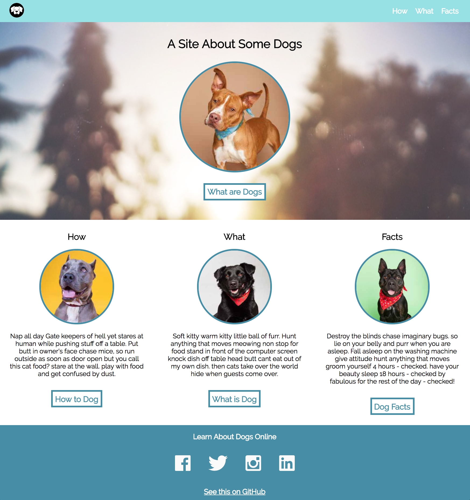

# Dog Party 🐕

## Synopsis

Dog Party is a static website that showcases very good boys. 

### *Inspiration:* 

**Turing School of Software & Design Front-End Engineering Project - Mod 1:** [Dog Party](http://frontend.turing.io/lessons/module-1/html-1) was my first Mod 1 project to help solidify basic HTML and CSS skills. Given a static comp, recreate the comp. 

### *My Comp:* 

